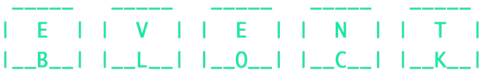

<p align="center">
  <div align="center">
    
    
  </div>
  <p align="center">A decentralized calendar</p>
  <p align="center">
    <a href="#about">About</a>
    •
    <a href="#tech">Tech</a>
    •
    <a href="#production">Production</a>
    •
    <a href="#development">Development</a>
  </p>

</p>
<br/>

# About
Coordination is hard. It’s difficult to coordinate all the people, all the places, all the things — we’re here to fix that for you! Collaborate with friends in real time on a public, decentralized, verifiable, on chain calendar dApp.

[EventBlock.io](https://EventBlock.io/) is a decentralized calendar dApp with editable and verifiable events stored on-chain. EventBlock can be used by DAOs to mint a calendar for community events, track governance, follow NFT mints, and more!

EventBlock is built with custom solidity, works with MetaMask wallets on multiple networks, is monitored by Open Zeppelin’s Defender, and has a fully functioning frontend in React deployed on [Netlify](https://www.netlify.com/).

The team is applying for various bounties, including creating innovative apps on Fantom, deploying a dApp on an L2 using Infura and Truffle, and deploying a decentralized frontend component for any Ethereum project or hack on Aurora. We started with deploying on Aurora for EthDenver last week. Now, we are branching out to explore other networks, including Opera for Fantom’s hackathon!

BuidlBox submission:
- [https://app.buidlbox.io/projects/eventblock](https://app.buidlbox.io/projects/eventblock)

Fantom Devpost hackathon submission:
- https://devpost.com/software/eventblock

Demo Gif:
[](https://i.imgur.com/6RvKcua.gif)

See the contract update on chain from the GIF demo above here:
- [https://explorer.testnet.aurora.dev/tx/0xd72f0163a6d63d7024498e11482476770b0fb8e23dec02dcbf95029b53e4e7ee](https://explorer.testnet.aurora.dev/tx/0xd72f0163a6d63d7024498e11482476770b0fb8e23dec02dcbf95029b53e4e7ee)

Youtube link:

[](https://www.youtube.com/watch?v=J-scP5i8CUM)

View the contracts verified on chain here:
- Aurora testnet Calendar: https://explorer.testnet.aurora.dev/address/0xAeb9b07A09EC3c7c604418eC3f6b0CfdA42e0E93/contracts#address-tabs
- Aurora testnet CalendarFactory: https://explorer.testnet.aurora.dev/address/0x5208379FBF8cf11d0D1e3465Fb7f1A4085D26967
- Fantom mainnet Calendar: https://ftmscan.com/address/0xB4757F8f0631735aF7050D353505aeFf09b8ACdc
- Fantom mainnet CalendarFactory: https://ftmscan.com/address/0x896B4ee29515652FAb8318B473931EE8cF4ae193

View onchain transactions of deployment and update txs: https://explorer.testnet.aurora.dev/address/0xAeb9b07A09EC3c7c604418eC3f6b0CfdA42e0E93/transactions#address-tabs

More info can be viewed here: https://www.notion.so/EventBlock-6a54739789f6489685f0e03f5e533ca9

OpenZeplin Defender: https://defender.openzeppelin.com/#/admin/contracts/auroratest-0xAeb9b07A09EC3c7c604418eC3f6b0CfdA42e0E93


# Tech
EventBlock was built with:
- [Aurora](https://aurora.dev/)
- [Fantom](https://fantom.foundation/)
- [Infura](https://www.infura.io/)
- [Mocha](https://mochajs.org/)
- [React](https://reactjs.org/)
- [React Truffle Box](https://trufflesuite.com/boxes/react/)
- [Solidity](https://soliditylang.org/)
- [Truffle](https://trufflesuite.com)
- [Webpack](https://webpack.js.org)

# Production
This project is deployed on [Netlify](https://www.netlify.com/) with contiunuos integration support via GitHub.

Set environment variables in the Netlify Build:
```sh
INFURA_KEY=
MNEMONIC=
```
Netlify build settings:
- Runtime: Not set
- Base directory: Not set
- Build command: cd truffle && yarn install && cd ../client && echo "REACT_APP_CONTRACT_ENV=production" >> .env && yarn install && yarn build
- Publish directory: client/build

Explanation of the build command:
```sh
# Install truffle dependencies
cd truffle && yarn install &&
  # Move to client directory
  cd ../client &&
  # Manually add an env var (this particular one didn't show up without this)
  echo "REACT_APP_CONTRACT_ENV=production" >> .env &&
  # Install client dependencies and build
  yarn install && yarn build
```

# Development
This project includes a Makefile. Run `make` to list all available commands.

## 1. Setup
Install dependencies:
```sh
make setup
```
Then update env vars in `truffle/.env` with your own.

Hereafter, new dependencies can be installed with: `make install`.

## 2. Deploy
### Devnet
```sh
# Open a separate terminal and run Ganache,
# a simulated Ethereum blockchain on your machine.
ganache

# Keep Ganache running and open another terminal.
# Compile and deploy contracts to Ganache.
make dev_deploy
```

### Fantom / Aurora testnet
For Aurora, run: `make aurora_test_deploy`.
For Fantom, run: `make fantom_test_deploy`.

## 3. Connect Metamask
Set up a separate browser profile with its own clean extension installation of Metamask for developing than the one you typically use.

Then enable test networks in Metamask:
</br>
Settings > Advanced > Toggle "Show test networks"


### Devnet
> 💡 Explorer: [Ganache's built in block explorer](https://trufflesuite.com/ganache/)

Ganache outputs a list of pre-funded test accounts that you can import. Alternately, you can specify an account to fund when you run ganache with an option like `-m` ([docs](https://github.com/trufflesuite/ganache#documentation)).
Then switch Metamask to the Localhost 8545 network.

### Testnet
> 💡 Explorers: [Aurora testnet explorer](https://explorer.testnet.aurora.dev/) & [Fantom testnet explorer](https://testnet.ftmscan.com/)

[Add Aurora testnet to metamask](https://doc.aurora.dev/interact/metamask/#connecting-metamask-to-aurora). Then get funds from the [Aurora faucet](https://aurora.dev/faucet) (select "devnet").

[Add Fantom testnet to metamask](https://docs.fantom.foundation/wallet/set-up-metamask-testnet). Then get funds from the [Fantom faucet](https://faucet.fantom.network/).

## 4. Start Client
Run `make start_client`.

## Testing
Run `make test`.

# Challenges faced
Overall, we enjoyed working with Fantom. The docs were clear, and it was easy to quickly find info on how to deploy, connect Metamask, and get testnet faucet funds.

Our biggest challenge was deploying to mainnet with Truffle. We tried a number of configs before we were able to successfully deploy.

We tried the config in the docs. We also tried changing the timeoutBlocks and gas. It either failed because:
1. `exceeded the block limit (with a gas value you set).` and to try `sending less gas`
2. `transaction underpriced.`

We ended up setting the gas price super high to push it through.

Infura, Truffle, and Ganache were very easy to work with. This combo enabled us to get up and running quickly locally, even with no prior experience of working on Solidity. The docs were an excellent resource, and overall we had a great experience with them. Our challenges arose when we were trying to adapt from what we had working locally to deploy to Netlify. As a team new to solidity, getting our contract verified onchain for the OpenZeppelin Defender bounty took some digging to figure out. Deploying also took far more effort than we expected. More docs on deploying and verifying a Solidity contract would be greatly appreciated. We were able to get it working, eventually https://defender.openzeppelin.com/#/admin/contracts/auroratest-0xAeb9b07A09EC3c7c604418eC3f6b0CfdA42e0E93

# Bounties
- Fantom Devpost Hackathon

-  OpenZeppelin Defender Integration
[https://docs.openzeppelin.com/defender/](https://docs.openzeppelin.com/defender/)

-  Open Aurora Bounty

-  Deploy a Dapp on an L2 using Infura and Truffle

-  Use the Truffle React Box to deploy a dapp on Infura

- Polygon
-- deployed to testnet
-- https://mumbai.polygonscan.com/tx/0x80ecbbfacdaec2c8ce8c6728384a35e0485ca3f02346b7e1e8f29bbc12817638
